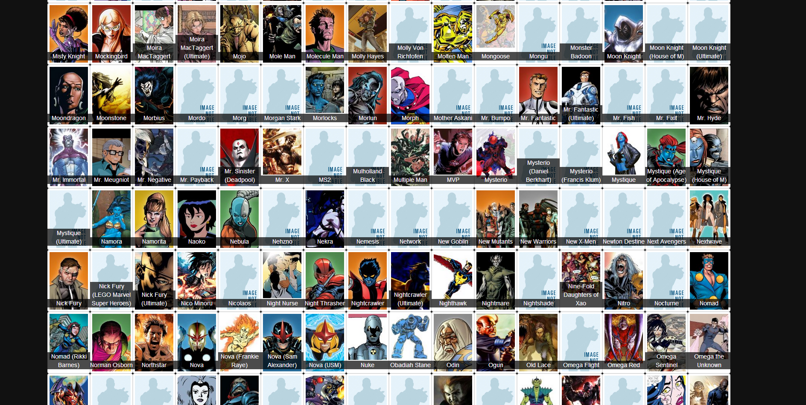
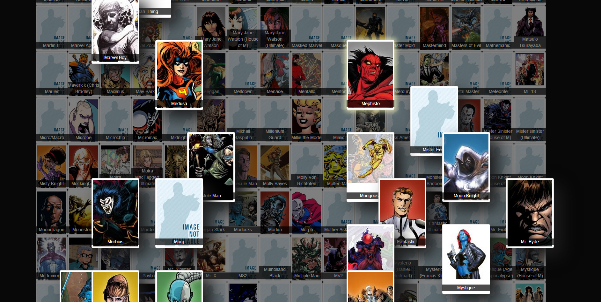

Marvel Character Cards
===========

Live demo: http://khanh.info/marvel_character_cards/

Playing with the Marvel API: http://developer.marvel.com/

Loads up all the characters it can fetch from the API and displays them. When the user clicks on a card, it will show who this character has met (been in a event/series/story together).

## Features

- Who has this character met? By 'met' I mean if the characters have been in any other stories, events or series with another.
- Quick search is available. Just type something and the javascript magic will find stuff for you. (Inspired by the character selection of DOTA2.)
- Press ESC key to reset the cards.
- It now uses a pre-fetched json file if we run out of API calls or if the API service is down.

## Screenshots

## Setup

Go to marvel_api/get_characters_url/index.php and enter your public and private keys.

Host it up on WAMP/MAMP/LAMP or whatever server you use and it should work.

## TO DO

- ~~Add caching so that we don't exceed our limit of calls~~
- Add lines to connect characters
- Add more stlying to make it look nicer and more visible

## Thanks to:
- [mezdef](https://github.com/mezdef) for helping me with the CSS
  
  
